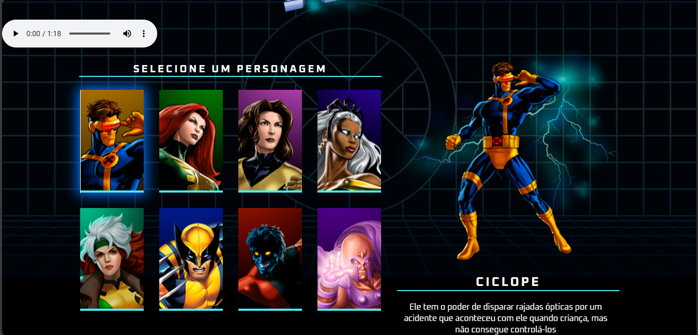

# 🦸‍♂️ X-Men Character Selection Page

A fun and interactive front-end project inspired by the X-Men universe.  
This project showcases a character selection interface with dynamic UI, smooth transitions, and responsive design, built entirely with **HTML, CSS, and JavaScript**.



---

## 📌 Overview

The **X-Men Character Selection Page** was created as a front-end practice project to combine creativity and coding skills.  
Users can explore a selection of X-Men characters, view their details, and interact with the interface in a modern, game-inspired design.

---

## ✨ Features

- Interactive character selection  
- Dynamic hover effects and transitions  
- Character highlights with details (name, abilities, etc.)  
- Responsive layout for desktop and mobile  
- Clean and modular code for easy customization  
- Theme inspired by classic X-Men visuals

---

## 🧰 Tech Stack

- **HTML5**  
- **CSS3** (including transitions and animations)  
- **JavaScript** (Vanilla)  

Optional improvements could include integrating a backend for stats or adding extra animations for more interactivity.

---

## 🚀 Getting Started

1. **Clone this repository**  
   ```bash
   git clone https://github.com/MoiRaibolt/X-Men-character-selection-page.git
2. Navigate to the project folder

  cd X-Men-character-selection-page


3. Open index.html in your browser

 Double click the file or open it via your favorite local server (VSCode Live Server recommended for better experience)

🖼️ Screenshots

(Add screenshots here to showcase the UI on desktop and mobile)

Character Selection	Hover Effects Example

	
💡 Future Enhancements

Add more character details, stats, and abilities

Include animations or audio effects

Connect with a backend for storing favorites or scores

Add themed skins or multiple UI modes

Implement keyboard or gamepad navigation for a game-like experience

🤝 Contribution

Contributions are welcome!
To contribute:

1. Fork the repository

2. Create a feature branch

3. Commit your changes

4. Push and submit a pull request

Please make sure your code follows best practices and is well documented.

🧾 License

This project is licensed under the MIT License — see the LICENSE
 file for details.
